# Blog 12 - May 1, 2020
## AWS : Monitor Estimated Charges Using CloudWatch

<p align="center">  </p>

On AWS, CloudWatch is a monitoring and observability service. CloudWatch provides users with data insights to monitor applications, respond to system-wide performance changes, optimize resource utilization, and provide a screenshot of the infrastructure's operational health. Monitoring and operational data is collected in the form of logs, metrics, and events, providing users with a unified view of AWS resources, applications, and services that run on AWS on-premise servers. CloudWatch detects odd behavior in any environment, sets alarms, visualizes logs and metrics together, takes automated actions, troubleshoots issues, and provides tips to keep applications functional.

<p align="center">  </p>

***Note: You must be either an AWS root user or IAM user with access to the Billing and Cost Management console to do this.***

- Enable Billing Alerts

Before creating an alarm for estimated charges, we need to enable billing alerts. This will allow us to monitor estimated AWS charges and create an alarm using billing metric data. One we enable enable billing alerts, data collection cannot be disabled. However, it is possible to delete any billing alarms created earlier.

After billing alerts are enabled for the first time, it will take about 15 minutes for billing data to be visable. Then, we can set billing alarms.

<p align="center">  </p>

To enable monitoring of our estimated charges, open the Billing and Cost Management console. In the navigation pane, choose Preferences and select Receive Billing Alerts. Then, select Save Preferences.

- Create a Billing Alarm
- Check the Alarm Status
- Edit a Billing Alarm
- Delete a Billing Alarm

# Blog 11 - April 24, 2020
## AWS : Set in Motion a Linux Virtual Machine with Amazon Lightsail

<p align="center">  </p>

On AWS, Lightsail offers virtual servers, storage, databases and networking, plus a cost-effective, monthly plan. It is very user-friendly to new users, allowing customization and scalability.

We wil create an AWS Linux instance in Lightsail instantaneously. Once the instance is up and running, we will connect to it via SSH within the Lightsail console using the browser-based SSH terminal.

- Create an AWS Linux Instance in Lightsail 

Go to Management Console from the Services menu and choose Lightsail. Choose Create Instance in the Instances tab of the Lightsail home page.

<p align="center">  </p>

- Configure your AWS Lightsail Instance

The default AWS Region and Availability Zone is Oregon US-West-2. Select another region and availability zone if you wish to change it. Next, choose the Linux/Unix platform option, and choose OS only to view the operating system-only instance images available in Lightsail. After that, choose the Amazon Linux blueprint option.

<p align="center">  </p>

***Optional Configurations***

1. You can chooose to add a shell script that will run on the instance when it launches. (Add Launch Script)
2. You can select, create, or upload the key pair you would like to use to SSH into your instance. (Change SSH Key Pair)
3. You can automatically create a backup image of your instance and attached disks on a daily schedule. (Enable Automatic Snapshots)

<p align="center">  </p>

<p align="center">  </p>

Next, you will choose your instance plan. You can try the $3.50 USD Lightsail plan free for one month (up to 750 hours). It has credit for one free month.

<p align="center">  </p>

After that, enter a name for your instance. It would also be wise to add tags to your instance with one of the following options:

1. Add key-only tags: Type your new tag into the tag key text box, then press Enter when finished. Select Save when you are done entering all of your tags, or choose Cancel to not add all of them.

2. Create a key-value tag: Type a key into the Key text box, and a value into the Value text box. Select Save when you are done entering all of your tags, or choose Cancel to not add all of them. Remember that key-value tags are only added one at a time before saving. To add more than one key-value tag, you have to repeat the first steps.

<p align="center">  </p>

Finally, select Create Instance. In a few minutes, your Amazon Linux instance is will be ready, and you can connect to it using the browser-based SSH terminal in the Lightsail console.

- Connect to your Instance

The last step is to connect to your instance using the browser-based SSH terminal in Lightsail. Go to the Instances tab of the Lightsail home page and choose the terminal icon, or the ellipsis icon, next to the new Linux instance. The browser-based SSH terminal window should appear. You can type Linux commands into the browser terminal to start and manage your instance without configuring an SSH client.

<p align="center">  </p>

# Blog 10 - April 17, 2020
## AWS : Deploy a Sample Application with Elastic Beanstalk 

<p align="center">  </p>

On AWS, an Elastic Beanstalk is a simple service for deploying and scaling web applications and services developed with Java, .NET, PHP, Node.js, Python, and Docker on familiar servers such as Apache, Nginx, and Passenger.

By simply uploading code, Elastic Beanstalk will automatically handls the deployment, from capacity provisioning, load balancing, auto-scaling to application health monitoring. The user retains total control over the AWS resources powering the application . The user also can access the underlying resources at any time.

***Planned Setup***

<p align="center">  </p>

Elastic Beanstalk's best advantage is that a user only pays for the AWS resources needed to store and run the application.

***Note: You must have an Elastic Beanstalk environment without an application running on it to continue.***

- Access the Elastic Beanstalk Environment

Go to Management Console from the Services menu and choose Elastic Beanstalk. A page titled All Applications opens up, and it should show a green box (indicating good health) that details the conditions for your existing Elastic Beanstalk application.

***Example***

<p align="center">  </p>

In the green application details box, click on the URL value displayed. It will take you to the Dashboard page for your Elastic Beanstalk environment. The Elastic Beanstalk environment is prepared to host an application. What's missing is the running code.

Now, at the top of the page, click the URL that ends in elasticbeanstalk.com. When you click it, a new browser tab opens. However, you should display an "HTTP Status 404 - Not Found" message. This is expected because this application server doesn't have an application running on it yet. Go back to the Elastic Beanstalk console without closing that browser.

- Deploy a Sample Application to Elastic Beanstalk

Download a sample application by clicking this link: https://docs.aws.amazon.com/elasticbeanstalk/latest/dg/samples/java-tomcat-v3.zip

In the Elastic Beanstalk console, click Upload and Deploy. Next, click Browse or Choose File, then navigate to and open the java-tomcat-v3.zip file that you just downloaded to deploy it. It will take about two minutes for Elastic Beanstalk to update your environment and deploy the application. Ignore any warnings that may pop-up at this time. 

Once the deployment is complete, go back to the browser tab that displayed the 404 status to refresh that page.

The web application that you deployed is now displayed.

<p align="center">  </p>

Going back to the Elastic Beanstalk console, click Configuration. Keep a close eye on the details. In the Instances row, it indicates the instance type, monitoring interval, and security group details of any EC2 instances that are hosting your web application.

Go to the bottom of the page to the Database row. It should not have any details since the environment does not include a database.

In the Database row, click Modify. Next, click Monitoring. Browse through the charts to see the available information. 

- Explore the AWS Resources that Support your Application

In the Services menu, choose EC2. Next, click Instances. Note the number of instances are running. Those instances should support your web application. 

If you want to continue exploring the EC2 service resources created by Elastic Beanstalk, go ahead and explore them. You will find a security group with port 80 open, load balancer that both instances belong to and an auto scaling group that runs from two to six instances, depending on the network load. 

<p align="center">  </p>

# Blog 9 - April 10, 2020
## AWS : How to Build and Interact with a Relational Database Service

<p align="center"> 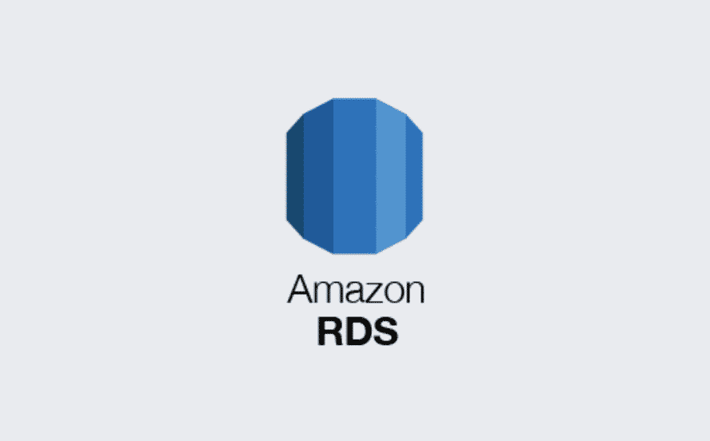 </p>

On AWS, a Relational Database Service (RDS) is easy to set up, operate, and scale a relational database in the cloud. It is noted to be cost-efficient due to its resizeable capabilities while managing time-consuming database administration tasks. RDS allows users to focus on applications and business and provides users with six familiar database engines to choose from: Amazon Aurora, Oracle, Microsoft SQL Server, PostgreSQL, MySQL and MariaDB.

***Note: An established web server altogether is not necessary. But you will need to at least have an established VPC with two private and two public subnets under two different availability zones, an internet gateway and a NAT gateway.***

***Beginning Infrastructure***
<p align="center"> 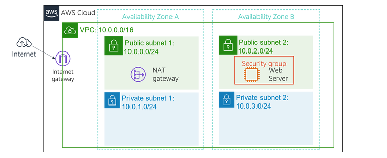 </p>

- Create a Security Group for the RDS DB Instance

We will create a security group to allow a web server to access your RDS DB instance. When the database instance is launched, the security group will be used. First, in the AWS Management Console, go to on the Services menu and click VPC. Then, in the left navigation pane, click Security Groups.

Click Create Security Group and then configure:
```
Security group name: DB Security Group
Description: Permit access from Web Security Group
VPC: name of your VPC
```

Click Create. Then click Close.

Now, let's add a rule to the security group to permit inbound database requests. First, select DB Security Group and click the Inbound Rules tab. The security group should have no rules, or rules you estalished earlier. Now, we will add a rule to permit access from the Web Security Group (if you have a rule permitting traffic on port 3306, skip this step).

Click Edit Rules. Next, click Add Rule then configure:
```
Type: MySQL/Aurora (3306)
CIDR, IP, Security Group or Prefix List: Type sg and then select Web Security Group.
```

This configures the Database security group to permit inbound traffic on port 3306 from any EC2 instance that is associated with the Web Security Group. Finally, click Save Rules then click Close. This will be the security group when launching the Amazon RDS database.

- Create a DB Subnet Group

We will create a DB subnet group that is used to tell RDS which subnets can be used for the database. Each DB subnet group requires subnets in at least two Availability Zones. First, on the Services menu, click RDS. In the left navigation pane, click Subnet groups.

Click Create DB Subnet Group then configure:
```
Name: DB Subnet Group
Description: DB Subnet Group
VPC: name of your VPC
Availability zone: Select the first Availability Zone
Subnet: add your private subnet
Click Add subnet
```

This will add one of the private subnets. You will now add a second private subnet.

Configure these settings (on the existing screen):
```
Availability zone: Select the second Availability Zone
Subnet: add your private subnet
Click Add subnet
```

Your private subnets (i.e. 10.0.1.0/24 and 10.0.3.0/24) should now be shown in the list. Finally, click Create. When you create the databse in the next task, you will use this database subnet group.

- Create an Amazon RDS DB Instance

We will configure and launch a Multi-Availability Zone (AZ) Amazon RDS for MySQL database instance.

***What are RDS Multi-AZ deployments?***

RDS Multi-AZ deployments provide enhanced availability and durability for database instances. They are a great fit for production database workloads. By provisioning a Multi-AZ DB instance, an RDS automatically creates a primary database instance and synchronously replicates data to a standby instance in a different Availability Zone (AZ).

First, in the left navigation pane, click Database. At the top of the screen, click if you see Switch to the New Database Creation Flow. Next, Select MySQL.

Under Settings, configure:
```
DB instance identifier: lab-db
Master username: master
Master password: samplepassword987
Confirm password: samplepassword987
```

Under DB instance size, configure:
```
Select Burstable classes (includes t classes).
Select db.t3.micro
```

Under Storage, configure:
```
Storage type: General Purpose (SSD)
Allocated storage: 20
```

Under Connectivity, configure:
```
Virtual Private Cloud (VPC): name of your VPC
```

Expand Additional connectivity configuration, then configure:
```
For Existing VPC security groups: click DB Security Group to highlight it in blue
```

Expand Additional configuration, then configure:
```
Initial database name: lab
Uncheck Enable automatic backups.
Uncheck Enable Enhanced monitoring.
```

This will turn off backups. Not normally recommended, but will make the database deploy faster for this tutorial. After that, click Create Database. The database will now be launched.

If an error pops up that mentions "not authorized to perform: iam:CreateRole", make sure you unchecked Enable Enhanced monitoring in the previous step.

Next, click sample-db (click the link itself). Now, you will wait about four minutes for the database to be available. The deployment process is deploying a database in two different Availability zones. Wait until Info changes to Modifying or Available.

Once this change is complete, scroll down to the Connectivity & Security Section and copy the Endpoint field. It will look similar to: lab-db.cggq8lhnxvnv.us-west-2.rds.amazonaws.com. Finally, paste the Endpoint value into a text editor. You will use it later.

- Interact with Your Database

We will open a web application running on your web server and configure it to use the database.

First, click on the Details drop down menu and then click Show. Next, copy the WebServer IP address. Open a new web browser tab, paste the WebServer IP address and press Enter. The web application will be displayed with information about the EC2 instance. Click the RDS link at the top of the page. We will now configure the application to connect to the database.

Configure the following settings:
```
Endpoint: Paste the Endpoint you copied to a text editor earlier
Database: lab
Username: master
Password: samplepassword987
```

Click Submit.

A message pops up, explaining that the application is executing a command to copy information to the database. After a few seconds, the application will display an Address Book. The Address Book application is using the RDS database to store information. Test the web application by adding, editing and removing contacts. The data is being held onto the database and is automatically replicating to the second Availability Zone.

<p align="center">  </p>

<p align="center">  </p>

***Completed Infrastructure***
<p align="center"> 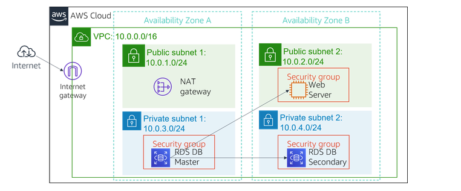 </p>

# Blog 8 - April 3, 2020
## AWS : Working with an Elastic Block Store

<p align="center"> 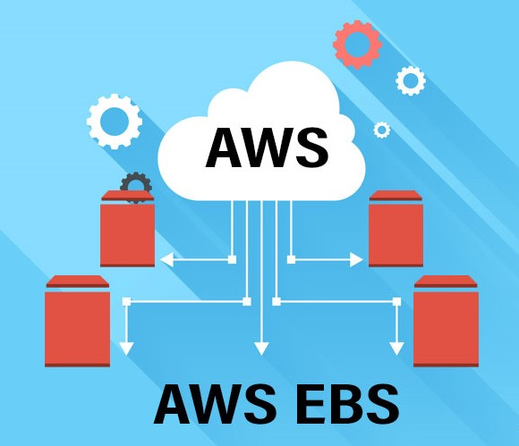 </p>

On AWS, an Elastic Block Store (EBS) is a key underlying storage mechanism for EC2 instances. They are network-attached and carry on independently from the life of an instance. EBS volumes are highly reliable volumes that can be used to maximum advantage as an EC2 instances boot partitions or attaches to a running EC2 instance as a standard block device.

We will create an Amazon EBS volume, attach it to an instance, apply a file system to the volume, and then take a snapshot backup.

***Note: You will need to have ready an AWS EC2 instance with basic Linux user administration to work with.***

- Create a New EBS Volume

<p align="center"> 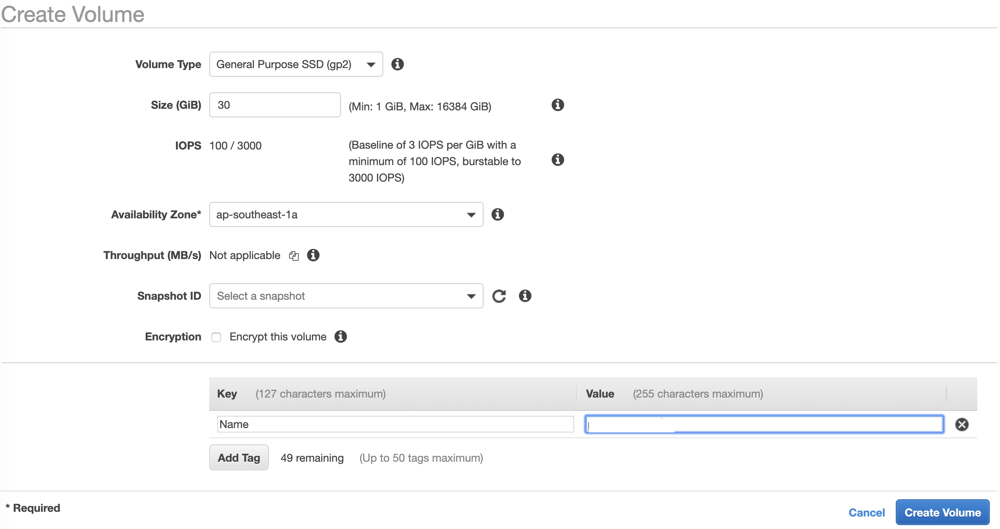 </p>

In this task, you will create and attach an EBS volume to a new EC2 instance. In the AWS Management Console, go to the Services menu and click EC2. In the left navigation pane, click Instances. Choose an available instance to work with and note its availability zone.

Next, in the left navigation pane, click Volumes. You will see an existing volume that is being used by your EC2 instance. The volume we will create will be 1 GiB in size, making it easy to distinguish. 

Click Create Volume then configure:
```
        Volume Type: General Purpose SSD (gp2)
        Size (GiB): 1. 
        Availability Zone: Select the same availability zone as your EC2 instance.
        Click Add Tag
```

In the Tag Editor, enter:
```
Key: Name
Value: My Volume
```

Click Create Volume then click Close. Your new volume will appear in the list. If not, click refresh to see your new volume.

- Attach the Volume to an Instance

<p align="center"> 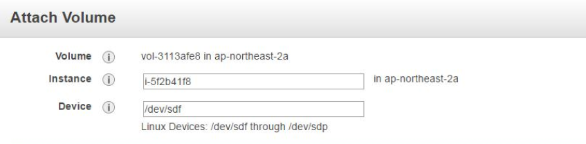 </p>

You can now attach your new volume to the Amazon EC2 instance. 

First, select My Volume. In the Actions menu, click Attach Volume. Then, click in the Instance field and select the instance name that you are working with, noting that the device field is set to /dev/sdf. Finally, click Attach. The volume state is now in-use.

- Connect to Your Amazon EC2 Instance

***Windows Users***

<p align="center">  </p>

Use SSH to connect using PuTTY. Download the .ppk file to host a session to connect to the EC2 instance with the IPv4 Public Value.   

***Mac and Linux OS Users***

<p align="center"> 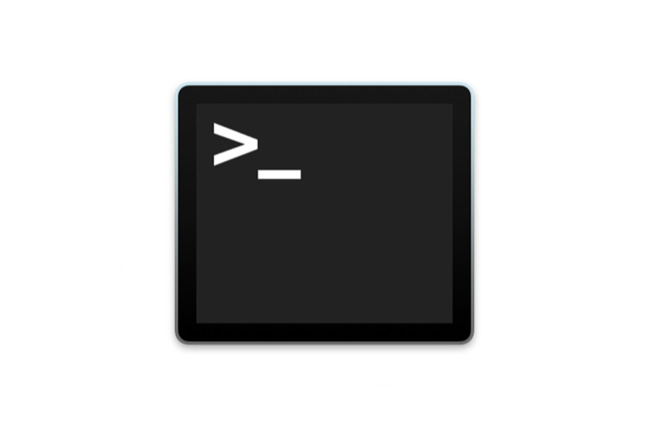 </p>

Use SSH to connect using the terminal/console. Download the .pem file and change the permissions for the file to be read. Connect to the EC2 instance with the IPv4 Public Value. 

- Create and Configure Your File System

Now, you will add the new volume to a Linux instance as an ext3 file system under the /mnt/data-store mount point.

First, view the available storage on your device:
```
df -h
```

Create an ext3 file system on the new volume:
```
sudo mkfs -t ext3 /dev/sdf
```

Create a directory for mounting the new storage volume:
```
sudo mkdir /mnt/data-store
```

Mount the new volume:
```
sudo mount /dev/sdf /mnt/data-store
```

To configure the Linux instance, you will need to add a line to /etc/fstab: 
```
echo "/dev/sdf   /mnt/data-store ext3 defaults,noatime 1 2" | sudo tee -a /etc/fstab
```

View the configuration file to see the setting on the last line. Then view the available storage again. The output will now contain an additional line - /dev/xvdf:
```
cat /etc/fstab
df -h
```

On your mounted volume, create a file and add some text to it:
```
sudo sh -c "echo some text has been written > /mnt/data-store/file.txt"
```

Verify that the text has been written to your volume:
```
cat /mnt/data-store/file.txt
```

<p align="center">  </p>

- Create an Amazon EBS Snapshot

<p align="center"> 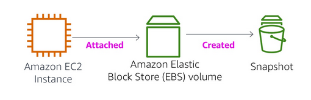 </p>

You can create any number of consistent, sychronized snapshots from EBS volumes at any time. EBS snapshots are stored in S3 with high durability. A new EBS volume can be created out of snapshots for cloning or restoring backups. They can also be easily shared among users or copied over regions.

First, in the AWS Management Console, click on Volumes and select My Volume. Then, in the Actions menu, click Create Snapshot.
Click Add Tag, then configure:
```
    Key: Name
    Value: My Snapshot
```
Click Create Snapshot then click Close. Now, go to Snapshots.

Your snapshot is displayed. It will start with a state of pending and then it will then change to a state of completed. Only used storage blocks are copied to snapshots, so empty blocks do not take any snapshot storage space.

In your remote SSH session, delete the file that you created on your volume and verify that it was deleted:
```
sudo rm /mnt/data-store/file.txt
ls /mnt/data-store/
```
<p align="center">  </p>

# Blog 7 - March 27, 2020
## How to Safely Store AWS Credentials

<p align="center"> 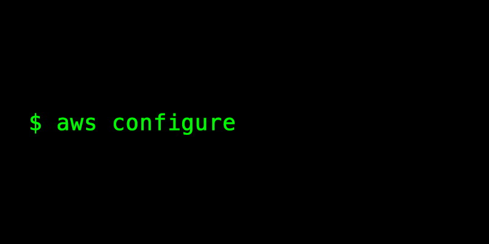 </p>

By default, the AWS command line interface stored key id and secret in plaintext "somewhere in a well-known location." There is a method to make this a little bit harder. AWS config has a setting that allows AWS to source the credentials externally. This is very handy if you don not want to store credentials as plain text files. Every small step to take to a better secure system is a small step towards a better security leaning. This is known as "credential process." 

We can use this with native openssl to give you a poor person's encrypted AWS keys!

First we will take the AWS credentials and dump them to a temp file this is named key.json 

<p align="center"> 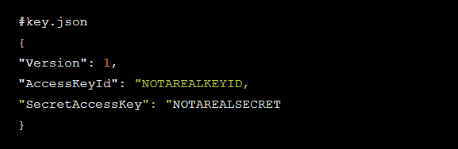 </p>

Next we are going to create a script named encrypt.sh. This will accept the file that is passed to it and then generate an encrypted file.

<p align="center"> 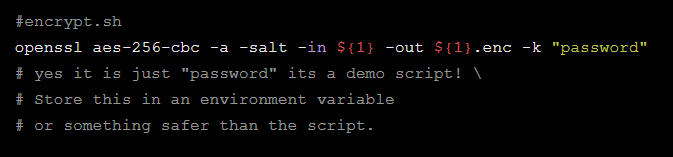 </p>

Lets write a quick script that will decrypt the encrypted file and just echo it out. There is a built-in on openssl that can do it. Also include a proper shebang at the top of the file. This is crucial for AWS to be able to run the script properly. 

<p align="center"> 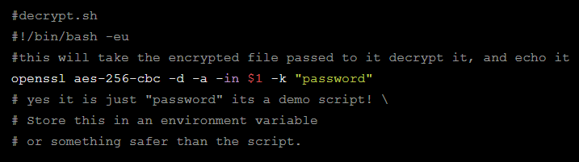 </p>

Encrypt the file and then prep it. 

<p align="center"> 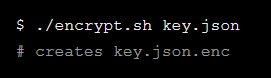 </p>

Now lets setup our AWS profile to read the credentials from the external process. We will need to update `~/.aws/config` and pass the full path of the script and the full path of the encrypted file. 

<p align="center"> 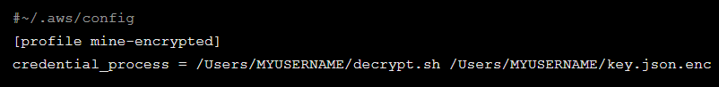 </p>

On the AWS CLI, we are going to tell the current session to use the new profile and verify if the whole process worked:

```
export AWS_PROFILE=mine-encrypted
aws sts get-caller-identity
```

There is another method for this as well. If there is a process out there that will issue the credentials for you and then stash them in your AWS profile, at least make the storing of those credentials a little bit better. This is a script that will handle that. You will provide the shell script with the named account profile to reference to use that account. This script also relies on having the decrypt.sh script from earlier.

<p align="center"> 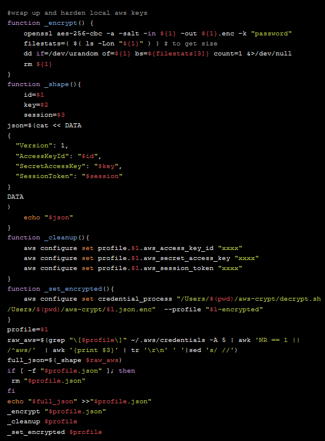 </p>

When we run this script it will look at the AWS credentials file, and pull out the id/key/token, drop those values into a new file, encrypt it, overwrite, then delete the temp file, and finally "xxxx" out the original values in the creds file. If the profile in question does not use session token, then simply remove that section of the script.

# Blog 6 - March 13, 2020
## Using Debian to Set Up a Web Developer Environment

<p align="center">  </p>

I am using Debian 9. Debian is also known as Debian GNU/Linux. It is a Linux distribution composed of free and open-source software, developed by the community-supported Debian Project. Every Debian release has long term support for about 5 years. Derivative distros as Ubuntu, Elementary, or Mint, use "apt" or packages ".deb," so the commands posted here can also work for such distros.

***note: I have Debian 9 already installed in a virtual machine. ***

An excellent developer environment needs:
- An IDE or good text editor
- version control system
- the programming languages for you to develop
- some useful tools and utilities

Since this is for web development, here is what you will need:
- vscode: text editor, along some extensions for web development
- git: version control standar, and some git functions, aliases and tricks
- nodejs: JavaScript runtime
- some useful tools for web developers: (screenshots, GIMP, VLC, Slack, and teamViewer)

Prerequisites: 
Have sudo access ready. This command must return "root" :
```
sudo whoami
```

Check if system is updated:
```
sudo apt update
sudo apt upgrade
```

When you are ready, install these packages:
```
sudo apt install make curl build-essential openssl libssl-dev unzip
```

- A Nice Editor: Visual Studio Code

<p align="center">  </p>

```
sudo apt install ./code_x.xx.x-xx_amd64.deb
```

"Apt" will auto magically set up everything and when all is finished you can open vcsode from your terminal (typing "code"), menu or launcher. Once it is installed, make sure to look at extensions for VS Code.

- A Standard Version Control System: Git
<p align="center">  </p>

Git is super easy to install: 

```
sudo apt install git
git --version
```

You will be greeted with your git's version. First, identify yourself. For this you need to create an account. Provide your name and email address. Git embeds this information into each commit we do, like this:

```
git config --global user.name "Your Name"
git config --global user.email "your.name@domain.com"
```

Remember to put your name (or nickname) and your email. Now you should have Git installed and ready to use on your system. 

1. Git Alias (for Commands): https://github.com/GitAlias/gitalias
2. Undoing/Removing Commits in Git: https://sethrobertson.github.io/GitFixUm/fixup.html
3. Git Online Book: https://git-scm.com/book/en/v2

- Developing for JavaScript: Install NodeJS

<p align="center"> 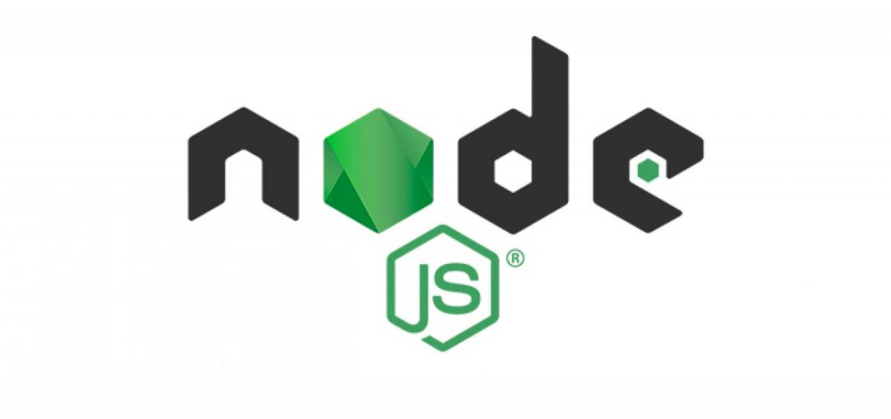 </p>

Most people find it difficult to install node in Windows in comparison to install it on Linux. This is usually one of the reasons developers turn to Linux as a new primary OS. Web programming usually involves NodeJS. Better sooner than later.

To install the current LTS version (other versions here) you must use your terminal:

```
curl -sL https://deb.nodesource.com/setup_12.x | sudo bash -
sudo apt install -y nodejs
```

1. Get started with NodeJS: https://www.w3schools.com/nodejs/nodejs_get_started.asp

Now you can use VSCode for making scripts and code to run over NodeJS, save it in a repository using Git and share it!

# Blog 5 - March 6, 2020
## How a C Program Translates into Assembly

<p align="center">  </p>

For developers that work with high-level languages, it is important to know how a language is translated from high-level to assmebly-level and eventually to binary. This post will cover the basics of translating a C language program into an assembly language program. This kind of information is strictly ties compiler and ABI. For most of the compilers, ABI and instruction set architecture, they follow nearly the same rules. 

First off, a bit about function stack frames:

1. During function code execution, a new stack frame is created in stack memory to allow access to function parameters and local variables.
2. The complete information on stack frame size, memory allocation, returning from stack frame, is decided at compile time.
3. Before diving into assembly code you should be aware of two things: (a) CPU registers of x86 machine; (b) x86 assembly instructions: As this is a very vast topic & updating quite frequently, we will only see the instructions needed for our examples.

<p align="center">  </p>

<p align="center">  </p>

<p align="center">  </p>

<p align="center">  </p>

We will consider the following example with its disassembly inlined to understand its different aspect of its working at machine level:

We will focus on a stack frame of the function "func()." But before analysing stack frame of it, we will see how the calling of function happens.

<p align="center">  </p>

- Function Calling

Function calling is done by call instruction of a particular line (Line 15) which is subroutine instruction equivalent to:

<p align="center">  </p>

Here, "call" stores the "rip+1" (not that +1 is just for simplicity, technically this will be substituted by the size of instruction) in the stack which is return address once call to "func()" ends. 

- Function Stack Frame

A function is divided into three parts:

1. Entry 
2. User Code
3. Exit

- Entry

As you can see in the instructions (lines 2 to 4) generated against the start bracket "{," it is setting up the stack frame for "func()." Line 2 is pushing the previous frame pointer into the stack and Line 3 is updating the current frame pointer with a stack end which is going to be a new frame start. "Push" is basically equivalent to:

<p align="center">  </p>

- Parameter Passing

"Func()" is stored in the "edi" register on Line 14 before calling the "call" instruction. If there is another argument, then it will be stored in a subsequent register or stack and the address will be used. Line 4 in "func()" is reserving space by pulling frame pointer (pointed by the "rbp" register) down by 4 bytes for the parameter "arg" as it is of type "int." Then the "mov" instruction will initialize it with a value store in "edi." This is how parameters are passed and stored in the current stack frame.

<p align="center">  </p>

- User Code / Allocating Space for Local Variables

Line 5 is reserving space for a local variable "a," again by pulling frame pointer further down by 4 bytes. The "mov" instruction will initialize that memory with a value of 5.

- Accessing Global and Local Static Variables

As you can see above, "g" is addressed directly with its absolute addressing because its address is fixed which lies in the data segment. This is not the case all the time. Here we have compiled our code for x86 mode, that’s why it is accessing it with an absolute address. In the case of x64 mode, the address is resolved using "rip" register which meant that the assembler and linker should cooperate to compute the offset of "g" from the ultimate location of the current instruction which is pointed by the "rip" register. The same statement stands true for the local static variables also.

- Exit

After the user code execution, the previous frame pointer is retrieved from the stack by the "pop" instruction which we have stored in Line 2. "Pop" is equivalent to:

<p align="center">  </p>

- Return from Function

The "ret" instruction jumps back to the next instruction from where "func()" called by retrieving the jump address from stack stored by the "call" instruction. "Ret" is a subroutine instruction which is equivalent to:

<p align="center">  </p>

If any return value specified then it will be stored in the "eax" register which you can see in Line 16.

# Blog 4 - February 28, 2020

## Creating Tables and Querying data with AWS DynamoDB

<p align="center">  </p>

Amazon Web Services offers a noSQL database known as DynamoDB. Its purpose is to serve as a hassle-free alternative to standard SQL databases since there are no servers to maintain, no backups to schedule and no problem scaling the database to millions of users. DynamoDB offers single millisecond latency and is a great choice to build RESTful APIs, IoT data stores and mobile backends. It is the usual choice for developers while working with other AWS services like Lambda. It also works well with most programming languages like Python, C++ and JavaScript through the AWS SDK. 

We will go through the steps of creating a table in DynamoDB and manipulate its data, as well as utlizing the search options. 

- Working with Tables

<p align="center">  </p>

Unlike MySQL, you do not have to create a database and then create tables within the database. DynamoDB offers a centralized database per account in which you can create any number of tables. First, login to your AWS account and search for "DynamoDB" in the "Find Services" textbox of the AWS Console. There you will select "DynamoDB" and take you to the dashboard. Let's create a new table.

Select "Create Table." You will be asked to enter a table name and a primary key. A primary key is used to uniquely identify a record in a table. DynamoDB allows you to create two types of primary keys:

1. Partition Key: A simple primary key that has the value of the partition in which the data is stored. If a partition key is used as the primary key, no two records can be in the same partition. eg. a unique name.

2. Composite Key: A composite key is a combination of a partition key and a sort value. This enables multiple records to be stored in a single partition with unique sort values within that partition eg. a unique name (partition key) + a member id (sort key)

After entering a table name and its primary key (with or without the sort key), select "Create." Your table should be created and you can start adding data into your DynamoDB table.

<p align="center">  </p>

Select "Items," where all the items in your table are displayed. Let’s create a new item by selecting "Create Item." You will see the pop-up with the option of adding values to the fields that you have created. You can also add/remove new columns using the "+" icon.

<p align="center">  </p>

Make sure to provide a unique primary key while adding records. If not, DynamoDB will return an error. Once you have created a few records, it is easy to update/delete records from your table. Select one or more records and then select "Actions" to edit or delete the records from the table.

<p align="center">  </p>

- Searching (Scan and Query)

The main purpose of adding data to a database is to retrieve that data when needed. DynamoDB has two data retrieval methods: Scan and Query.

1. Scanning returns every record in the database. Scanning a table is useful when you try to work with an entire table and all the values contained in the table. However, scanning is very computing-heavy. If your table contains a large data set, you can easily run out of the free tier capacity offered by AWS.

2. Query is the other data retrieval method offered by DynamoDB. Query lets you use filters to select a range of data to be returned, making the operation more efficient compared to a Scan operation. Query is also similar to the data querying methods used in traditional SQL.

<p align="center">  </p>

- Indexing

A database is never complete without the option of indexing data. Indexes are used to improve search performances of specific columns in a table by storing an additional searchable version of column(s). Even though indexes use additional space, they offer great improvements in performance. 

Creating an index in DynamoDB is easy. Select "Indexes," then select "Create Index." Choose the partition key and an optional sort key along with a name for the index. You can also choose the "Projected Attributes" which will only include the keys you choose while returning search results. Just remember that creating indexes can also include additional monthly costs in addition to the DynamoDB pricing! 

<p align="center">  </p>

# Blog 3 - February 21, 2020

## Setting up AWS Infrastructure: EC2, EBS, and S3

<p align="center">  </p>

Amazon Web Services can get overwhelming with all the services offered for beginners. Some of the popular services includes Elastic Compute Clouds (EC2), Elastic Block Stores (EBS) and Simple Service Storage (S3) buckets. 

- First, we will create an S3 bucket. 

An S3 bucket provides object storage through a web service interface. Login to your AWS account and search for "S3." Click on "S3" and it will take you to the S3 page. Click on "Create Bucket" and create a bucket by specifying the region of your choosing. Give a unique name to your bucket. We can configure the bucket as per our requirement. If we want to keep multiple versions of the objects, we can enable versioning. There are different options available, for now we will keep everything unticked (default) and click "Next."

By default, S3 bucket blocks all public access to it. We will allow the public access to try out a few operations externally/publicly. To make the bucket public, untick "Block all public access" checkbox and click on "Next." Now that everything is set, click "Create the Bucket."

<p align="center">  </p>

- Second, we will create an EC2 instance.

An EC2 instance is a web service that provides secure, resizable compute capacity in the cloud. It is designed to make web-scale cloud computing easier for developers. Search for "EC2" at the top. Then select "Instance" from the side. You will then select "Launch Instance" to create a new EC2 instance. First, choose the machine image. Then, choose EC2 instance types. Then, configure the instance and add storage.

<p align="center">  </p>

- Third, we will create an IAM Role to enable S3 access from an EC2 instance.

Search for "IAM" at the top. Identity and Access Management (IAM) enables you to manage access to AWS services and resources securely. Using IAM, you can create and manage AWS users and groups, and use permissions to allow and deny their access to AWS resources. Select "Roles" on the side and select "Create Role." Search for "AmazonS3" and select "AmazonS3FullAccess" to create the IAM role. Give the role a unique name and provide a small description. 

This role will be attached to the EC2 instance created earlier. Select the EC2 Instance and click on "Actions." Go to Instance settings and click on "Attach/Replace IAM Role option." Select the IAM role from the drop-down list and click on "Apply." The role has been attached successfully.

<p align="center">  </p>

You will now need to login to your EC2 instance. The method I use is through PuTTY. Here is a tuturial on how to utilize PuTTY to access the EC2 instance: https://www.youtube.com/watch?v=bi7ow5NGC-U 

After successfully entering the EC2 instance, install AWS command line interface. Follow the tuturial here: https://linuxhint.com/install_aws_cli_ubuntu/

- Fourth, we will create and attach and 8G EBS volume to the instance created earlier. 

Make sure to format and mount the filesystem using ext4 or any formatting you’d like. Ideally you would want the EBS mount to automount on reboot and this can be done by modifying the fstab.

Step 1: Head over to EC2 > Volumes and create a new volume of your preferred size and type.

Step 2: Select the created volume, right click and select the "Attach Volume" option.

Step 3: Select the instance from the instance text box.

Step 4: Now, login to your ec2 instance and list the available disks using:

```
lsblk
```

Step 5: Check if the volume has any data using:

```
sudo file -s /dev/xvdf
```

If the above command output shows "/dev/xvdf: data", it means your volume is empty.

Step 6: Format the volume to ext4 filesystem  using:

```
sudo mkfs -t ext4 /dev/xvdf
```

Step 7: Create a directory of your choice to mount our new ext4 volume. I am using the name “newvolume”

```
sudo mkdir /newvolume
```

Step 8: Mount the volume to "newvolume" directory using:

```
sudo mount /dev/xvdf /newvolume/
```

Step 9: cd into newvolume directory 

By default on every reboot the  EBS volumes other than root volume will get unmounted. To enable automount, you need to make an entry in the /etc/fstab file.

Step 10: Back up the /etc/fstab file.

```
sudo cp /etc/fstab /etc/fstab.bak
```

Step 11: Open /etc/fstab file and make an entry in the following format.

```
device_name mount_point file_system_type fs_mntops fs_freq fs_passno
```

Step 12: Execute the following command to check id the fstab file has any error.

```
sudo mount -a
```

- Fifth, run an "aws s3 cp" command to copy either a newly created / existing file from the EC2 instance to the bucket created earlier. The command should be able to be executed without having to run "aws configure."

```
aws s3 cp test.txt s3://<mybucketname>/test2.txt
```

<p align="center">  </p>

<p align="center">  </p>

<p align="center">  </p>

# Blog 2 - February 14, 2020

## Setting up Atom as a Python IDE

<p align="center">  </p>

You can setup and maintain a python friendly development environment using Atom.  Developers typically want to reduce the amount of application switching as much as possible and create repeatable workflows. Atom was developed initially from with Github, making it open-source and extensible by nature. It has a strong community that provides support and additional plugin functionality.

**Note: I have Atom 1.40 installed and primarily use Python 3+ with it.**

<p align="center"> 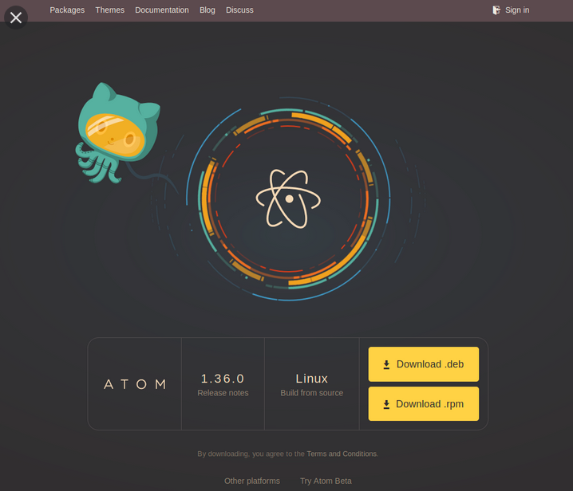 </p>

- First, download and install Atom. https://flight-manual.atom.io/getting-started/sections/why-atom/

You can use Atom's UI to install the plug-ins listed below using Atom's Settings View: just type ctrl + (on Linux or a PC), or cmd + (on a Mac). 

You can also go to the "Settings View," you can click on the "Install" tab, and type the package name you want to install into the "Search Packages" search box.

- Download a Linter Package (Source Code Checker)

<p align="center">  </p>

Linter is a base linter provider for the Atom Editor. You will install a specific linter for your language. Here is a link to a full list of Linter Packages: atomlinter.github.io. or https://atom.io/packages/linter.

Linters provide a top-level application programming interface to its user so that they can visualize errors and other types of messages with ease.

So, on the command line: `apm install linter`

Then, download a language specific linter plugin. (I will be using flake8)

```
pip install flake8
apm install linter-flake8
```

- Download a Python AutoComplete Package and AutoFormatter

<p align="center">  </p>

Python completions for packages, variables, methods, functions, with their arguments. You can either use Jedi or Kite. Since Jedi is a locally based library (and kite is online based), I will be using that one. 

```
apm install autocomplete-python
```

Use autopep8 (already installed) to format python code according to the pep8 (python's style guide) guidelines:

```
pip install autopep8
apm install python-autopep8
```

- Download a Script Package

<p align="center">  </p>

Run scripts based on the file name, a selection of code, or by the line number. This is VERY handy for testing your code from within Atom instead of going to a different terminal window. It is powerful because it is selection-based, which means you can run snippets instead of whole files.

```
apm install script
```

- Download a File-Icons Package

<p align="center">  </p>

File-icon packages are similar to the vs code-icons pack for Visual Studio Code (https://github.com/vscode-icons/vscode-icons) and built off of the logo-file-icons pack (https://atom.io/packages/logo-file-icons) with tweaks and additions.  

```
apm install atom-file-icons
```

- Download a Syntax Highlighting Theme

<p align="center">  </p>

This is a common syntax theme for Atom Material UI. Inspired by Mattia Astorino's SublimeText theme.

```
apm install atom-material-syntax
```

- Download and Install Minimap

<p align="center">  </p>


The Minimap package displays a Minimap preview of your file on the right hand side of your editor. The following plug-ins are also helpful: 

- minimap-git-diff 
- minimap-highlight-selected 

```
apm install minimap
apm install minimap-git-diff 
apm install minimap-highlight-selected 
```

- Install the Hydrogen Package

<p align="center">  </p>

Hydrogen runs code interactively, allows you to inspect data, and plot. It has all the power of Jupyter kernels inside Atom. It supports Python, R, JavaScript and other Jupyter kernels.

This post details what can be done with Hydrogen: https://nteract.gitbooks.io/hydrogen/

```
apm install hydrogen
```

- Using Version Control (or Cloud Drives) for Configuration Portability

Use version control for your Atom config file. You can find them, then host and clone your Git repository on Github, gitlab, Bitbucket, etc., and retrieve it on other computers simply by running:

```
git clone https://github.com/{username}/{repo}
```

As with any other source-control repository, you can then keep it up to date to upload changes and to download changes, aka git push
and git pull. To track a common list of installed packages, at the terminal shell execute:

```
apm list --installed --bare > ~/.atom/package.list
```

Add the file to you source-controlled Git repository also. To install the packages automatically, go back into a fresh installation of Atom:

```
apm install --packages-file ~/.atom/package.list
```

# Blog 1 - February 7, 2020

## Install WordPress on Ubuntu 18.04 Using a LAMP Stack

<p align="center">  </p>

Installing Wordpress on Ubuntu 18.04 allows you to have full control of the WordPress backend for experimentation and advanced uses. The LAMP stack will be used for your WordPress development environment on a VPS, or virtual private server, which is one of the most popular ways to host a service. 

To refresh, LAMP atands for Linux, Apache, MySQL, and PHP. Make sure you are logged in as root prior of starting the tuturial or follow each of the commands using sudo. You will also need to have access to your VPS using SSH. The UFW firewall ahould allow HTTP and HTTPS traffic. 

You can check by running the command: 
```
sudo ufw app list
```

- Install and Configure Apache:

First, install Apache web server 2. Press Y and "enter" to continue with the installation:
```
sudo apt update
sudo apt install apache2
```

Now there will be a list of available applications to choose from. We are going to select "Apache Full." To allow HTTP and HTTPS traffic (if it is not allowing it to pass through), you can execute the command below:
```
sudo ufw allow in "Apache Full"
```

To confirm the installation: 
```
sudo ufw app info "Apache Full"
```

To find your public IP address:
```
ip addr show eth0 | grep inet | awk '{ print $2; }' | sed 's/\/.*$//'
```

You will need your public IP address to verify that Apache was installed correctly. 

- Install MySQL:

Now that the webserver is running, we will install the MySQL database. Press Y and "enter" to continue with the installation:
```
sudo apt install mysql-server
```

Open MySQL:
```
sudo mysql
```

Set a password for the root user:
```
mysql> ALTER USER 'root'@'localhost' IDENTIFIED WITH mysql_native_password BY 'Password;
```

Reflect these changes using the flush command:
```
mysql> FLUSH PRIVILEGES;
```

Type "exit" to exit the MySQL prompt. 

- Install PHP:

Now we will install PHP to display dynamic content.
```
sudo apt install php libapache2-mod-php php-mysql
```

Install Additional PHP extensions for WordPress using the command below:
```
sudo apt install php-curl php-gd php-xml php-mbstring  php-xmlrpc php-zip php-soap php-intl
```

When you request a directory, the index.html is displayed as a default setting. In case you want to show index.php instead of index.html, you need to open the dir.conf file using the vi editor:
```
sudo vi /etc/apache2/mods-enabled/dir.conf
```

Swap the positions of index.html and index.php. Save the changes and exit the vi editor. For the changes to be visible, restart the Apache server using:
```
sudo systemctl restart apache2
```

To test the PHP, you can create a sample PHP file sample.php and add these lines of code. This file needs to be added to the Web Root of Apache which is located at – /var/www/html/. Once this is saved, you can try to access this page by using http://Your_Public_IP/Sample.php.

- MySQL Setup for WordPress:

Now, login to MySQL as the root user:
```
mysql -u root -p
```

Create a new database for Wordpress. Below we have created a new DB called WordPressDB:
```
mysql> CREATE DATABASE WordPressDB DEFAULT CHARACTER SET utf8 COLLATE utf8_unicode_ci;
```

Create a new user for Wordpress. We will name the user "WordpressUser"; "NewPasswordToBeSet" is in place of a strong password. Grant this user privilages: 
```
mysql> GRANT ALL ON WordPressDB.* TO ' WordPressUser '@'localhost' IDENTIFIED BY 'NewPasswordToBeSet';
mysql> FLUSH PRIVILEGES;
```

Exit the MySQL prompt. 

- Prepare to Install WordPress on Ubuntu:

Now, create a configuration file, for example :WordPress.conf. Place it to /etc/apache2/sites-available/. This will be a replica of the default configuration file which already exists in this location.

Also, create a WordPress directory (or you can provide any other name at location /var/www/). The complete location: /var/www/wordpress.

The file WordPress.conf will be the Apache configuration file for this testing. In the file, you can enable .htaccess by adding these lines to the VirtualHost block:

```
<Directory /var/www/wordpress />
AllowOverride All
</Directory>
```
Save the file. 

Enable mod_rewrite:
```
sudo a2enmod rewrite
```

In the file /etc/apache2/apache2.conf, you can change the ServerName directive by providing the server’s IP or hostname.
```
sudo apache2ctl configtest
```

To see all changes made, restart Apache: 
```
sudo systemctl restart apache2
```

- Configure and Install WordPress on Ubuntu

Now, go to this specific directory on Wordpress and extract the file: 
```
curl -O https://wordpress.org/latest.tar.gz
tar xzvf latest.tar.gz
```

Create a .htaccess file and save the file. Rename the wp-config-sample.php file.
```
vi /tmp/wordpress/.htaccess
mv /tmp/wordpress/wp-config-sample.php /tmp/wordpress/wp-config.php
mkdir /tmp/wordpress/wp-content/upgrade
sudo cp -a /tmp/wordpress/. /var/www/wordpress
```

To ensure that everything works correctly, change the ownership of the WordPress files to the www-data users and groups. Those are the users that Apache web server will use.
```
sudo chown -R www-data:www-data /var/www/wordpress
```

Set the correct permissions: 
```
sudo find /var/www/wordpress/ -type d -exec chmod 750 {} \;
sudo find /var/www/wordpress/ -type f -exec chmod 640 {} \;
```

Add the Wordpress salt to be generated: 
```
curl -s https://api.wordpress.org/secret-key/1.1/salt/
```

Add this to the wp-config.php file: 
```
vi /var/www/wordpress/wp-config.php
```

Replace the DB_NAME, DB_USER, DB_PASSWORD with values you have created for WordPress. Save the file after making the changes.

Also, you can add the file system method at the very bottom: 
```
define('FS_METHOD', 'direct');
```

Save the file. This completes the backend setup. You can access WordPress via the interface by using the URL http://IP_Address.

How to Work with a VPS using PuTTY:
```
https://www.hostinger.com/tutorials/how-to-connect-to-your-account-using-putty
```

# Blog 0 - January 31, 2020

## Using Python 3.4 + to Work with Excel Spreadsheets

Excel is a popular and powerful spreadsheet application for Windows 10 (and earlier versions). The openpyxl module allows your Python programs to read and modify Excel spreadsheet files. If you have the boring task of copying certain data from one spreadsheet and pasting it into another one, you can use Python to do this for you. 

<p align="center">  </p>

**Note: If you do not have Excel, there are alternatives to open .xlsx files that work on Windows, OS X, and Linux - LibreOffice Calc and OpenOffice Calc!**

- Excel Documents

First, let’s go over some basic definitions: An Excel spreadsheet document is called a workbook. A single workbook is saved in a file with the .xlsx extension. Each workbook can contain multiple worksheets. The sheet the user is currently viewing is called the active sheet. Each sheet has columns (addressed by letters starting at A) and rows (addressed by numbers starting at 1). A box at a particular column and row is called a cell. Each cell can contain a number or text value. The grid of cells with data makes up a sheet.

- Installing the openpyxl Module

Open the Python idle, and run: `import openpyxl`

If the module was correctly installed, there should be no error messages. Remember to import the openpyxl module before running the interactive shell examples in this chapter, or you’ll get `NameError: name 'openpyxl' is not defined error. `

- Opening Excel Documents with OpenPyXL

Once you’ve imported the openpyxl module, you’ll be able to use the openpyxl.load_workbook() function. Enter the following into the interactive shell:
```
import openpyxl
wb = openpyxl.load_workbook('example.xlsx')
type(wb)
> <class 'openpyxl.workbook.workbook.Workbook'>
```
The openpyxl.load_workbook() function takes in the filename and returns a value of the workbook data type. This Workbook object represents the Excel file, a bit like how a File object represents an opened text file.

- Getting Sheets from the Workbook

You can get a list of all the worksheet names in the workbook by calling the get_sheet_names() method. Enter the following into the interactive shell:
```
import openpyxl
wb = openpyxl.load_workbook('example.xlsx')
wb.get_sheet_names()
'Sheet1', 'Sheet2', 'Sheet3'
sheet = wb.get_sheet_by_name('Sheet3')
sheet 
> <Worksheet "Sheet3">
type(sheet) 
> <class 'openpyxl.worksheet.worksheet.Worksheet'>
sheet.title 
> 'Sheet3'
```
Each sheet is represented by a Worksheet object, which you can find by passing the sheet name string to the get_sheet_by_name() workbook method. Also, you can read the active member variable of a Workbook object to get the workbook’s active sheet. Once you have the Worksheet object, you can get its name from the title attribute.

- Getting Cells from the Sheets

Once you have a Worksheet object, you can access a Cell object by its name. Enter the following into the interactive shell:
```
import openpyxl
wb = openpyxl.load_workbook('example.xlsx')
sheet = wb.get_sheet_by_name('Sheet1')
sheet['A1'] 
> <Cell Sheet1.A1>
sheet['A1'].value datetime.datetime(2015, 4, 5, 13, 34, 2)
c = sheet['B1']
c.value 
> 'Apples'
'Row ' + str(c.row) + ', Column ' + c.column + ' is ' + c.value
> 'Row 1, Column B is Apples'
'Cell ' + c.coordinate + ' is ' + c.value
> 'Cell B1 is Apples'
sheet['C1'].value
> 73
```
The Cell object has a value attribute that contains the value stored in that cell. Cell objects also have row, column, and coordinate attributes that provide location information for the cell.

Here, accessing the value attribute of our Cell object for cell B1 gives us the string 'Apples'. The row attribute gives us the integer 1, the column attribute gives us 'B', and the coordinate attribute gives us 'B1'.

- Converting Between Column Letters and Numbers

To convert from letters to numbers, call the openpyxl.cell.column_index_from_string() function. To convert from numbers to letters, call the openpyxl.cell.get_column_letter() function. Enter the following into the interactive shell:
```
import openpyxl
from openpyxl.cell import get_column_letter, column_index_from_string
get_column_letter(1)
> 'A'
get_column_letter(2)
> 'B'
get_column_letter(27)
> 'AA'
get_column_letter(900)
> 'AHP'
wb = openpyxl.load_workbook('example.xlsx')
sheet = wb.get_sheet_by_name('Sheet1')
get_column_letter(sheet.max_column)
> 'C'
column_index_from_string('A')
> 1
column_index_from_string('AA')
> 27
```
The function column_index_string() does the reverse: You pass it the letter name of a column, and it tells you what number that column is. You don’t need to have a workbook loaded to use these functions.

- Getting Rows and Columns from the Sheets

You can slice Worksheet objects to get all the Cell objects in a row, column, or rectangular area of the spreadsheet. Then you can loop over all the cells in the slice. Enter the following into the interactive shell:
```
import openpyxl
wb = openpyxl.load_workbook('example.xlsx')
sheet = wb.get_sheet_by_name('Sheet1')
tuple(sheet['A1':'C3'])
> ((<Cell Sheet1.A1>, <Cell Sheet1.B1>, <Cell Sheet1.C1>), (<Cell Sheet1.A2>,
> <Cell Sheet1.B2>, <Cell Sheet1.C2>), (<Cell Sheet1.A3>, <Cell Sheet1.B3>,
> <Cell Sheet1.C3>))
for rowOfCellObjects in sheet['A1':'C3']:
for cellObj in rowOfCellObjects:
print(cellObj.coordinate, cellObj.value)
print('--- END OF ROW ---')
```
Here is the result:
```
> A1 2015-04-05 13:34:02
> B1 Apples
> C1 73
> --- END OF ROW ---
> A2 2015-04-05 03:41:23
> B2 Cherries
> C2 85
> --- END OF ROW ---
> A3 2015-04-06 12:46:51
> B3 Pears
> C3 14
> --- END OF ROW ---
```

First, we specify that we want the Cell objects in the rectangular area from A1 to C3, and we get a generator object containing the Cell objects in that area. Use the tuple() on it to display its cell objects in a tuple (to help visualize the generator object).

This tuple contains three tuples: one for each row, from the top of the desired area to the bottom. Each of these three inner tuples contains the Cell objects in one row of our desired area, from the leftmost cell to the right. So, our slice of the sheet contains all the Cell objects in the area from A1 to C3, starting from the top-left cell to the bottom-right cell.

Next, to print the values of each cell in the area, we use two for loops. In line 5, the outer for loop goes over each row in the slice. Then, in line 6, the nested for loop goes through each cell for each row.
